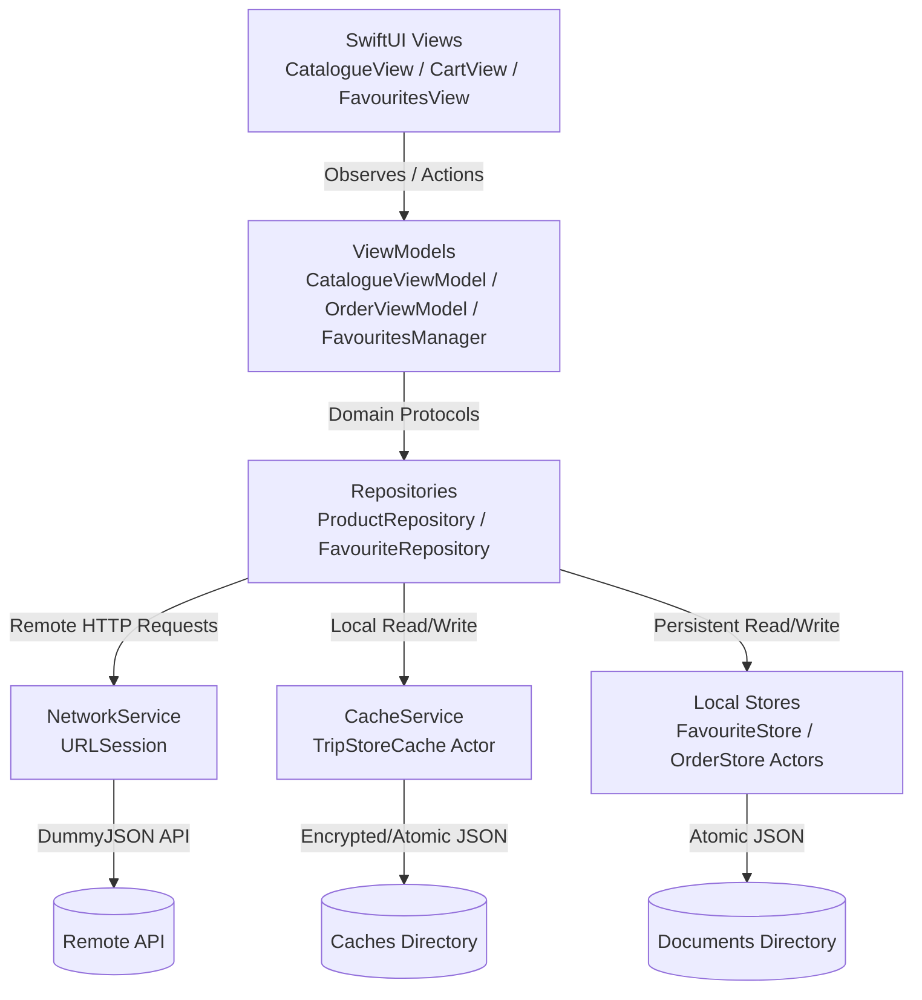

# TripStore 🛍️

A modern, production-grade iOS e-commerce application built with **SwiftUI**, **Clean Architecture (MVVM + Repository Pattern)**, and modern **Swift Concurrency** (`async`/`await`, `actor`, `@MainActor`). The app connects to the [DummyJSON API](https://dummyjson.com/docs/products) to deliver a seamless shopping experience complete with catalogue browsing, offline-first caching, real-time search with debouncing, multi-criteria filtering, local favorites, cart management, and order history.

---

## 📑 Table of Contents
1. [Features](#-features)
2. [Architecture Overview](#-architecture-overview)
3. [Cache & Offline Policy](#-cache--offline-policy)
4. [Setup & Installation](#-setup--installation)
5. [Running Tests](#-running-tests)
6. [Assumptions](#-assumptions)
7. [Trade-offs](#-trade-offs)
8. [Known Limitations](#-known-limitations)
9. [What I Would Improve With More Time](#-what-i-would-improve-with-more-time)
10. [AI Usage Disclosure](#-ai-usage-disclosure)

---

## 🌟 Features

- **Product Catalogue**: Paginated infinite scrolling list displaying product thumbnails, titles, brand names, ratings, and price calculations with applied discounts.
- **Search with Debouncing**: Real-time search powered by Combine (`debounce(for: .milliseconds(500))`) to prevent unnecessary network overhead.
- **Filter & Sort Sheet**: Filter by category and minimum rating, and sort by price (low to high, high to low) or rating.
- **Product Details & Gallery**: High-resolution image carousel gallery, detailed specifications, stock availability indicators, and interactive favorite toggling.
- **Shopping Cart & Checkout**: Add products, adjust quantities with steppers, view itemized price breakdown (including a 5% service fee), and perform simulated checkout.
- **Favorites / Wishlist**: Persistent favorites stored locally on-device.
- **Order History**: Review previous completed orders with timestamps, item summaries, and total amounts.
- **Offline First**: Offline caching with stale data detection and user-friendly offline notification banners (`StaleBanner`).

---

## 🏗️ Architecture Overview

The project adheres to **Clean Architecture** principles separated into feature-driven modules and shared core components.

```
TripStore/
├── App/
│   ├── TripStoreApp.swift            # App entry point & environment setup
│   ├── AppTabView.swift              # Main TabBar container (4 tabs)
│   └── DependencyContainer.swift     # Centralized Dependency Injection
├── Core/
│   ├── Models/                       # Shared domain models (Product, PaginatedResult)
│   ├── Network/                      # NetworkService, APIError, Network protocols
│   ├── Persistence/                  # CacheService (Actor-isolated disk cache)
│   ├── UIComponents/                 # Reusable UI views (ProductImageView, RatingView, EmptyStateView, etc.)
│   └── Utilities/                    # CurrencyFormatter, formatters, helpers
└── Features/
    ├── Catalogue/                    # Data (DTOs, Repository, APIEndpoint), Domain, Presentation (CatalogueView, ViewModel)
    ├── Favourites/                   # Data (FavouriteStore, Repository), Domain, Presentation (FavouritesManager, FavouritesView)
    ├── Orders/                       # Data (OrderStore), Domain (Order, CartItem), Presentation (CartView, OrderHistoryView, ViewModel)
    └── ProductDetail/                # Presentation (ProductDetailView, ImageGalleryView)
```

### Architectural Pattern: MVVM + Repository



- **Domain Layer**: Completely decoupled and framework-agnostic. Holds core entities (`Product`, `Order`, `CartItem`) and repository protocols (`ProductRepositoryProtocol`, `FavouriteRepositoryProtocol`).
- **Data Layer**: Implements repository protocols. Handles network requests via `NetworkServiceProtocol`, endpoint modeling via `APIEndpoint`, Data Transfer Objects (`ProductDTO`, `ProductListResponseDTO`), and caching through actor-isolated services.
- **Presentation Layer**: Built with SwiftUI declarative views and `@MainActor` annotated `ObservableObject` view models. View models handle UI state machines (`.loading`, `.loaded`, `.empty`, `.error(String)`), search debounce publishers, and filtering logic.
- **Dependency Injection**: Orchestrated centrally by `DependencyContainer`, injected into the environment as `@EnvironmentObject` to facilitate modularity and testability.

---

## 💾 Cache & Offline Policy

TripStore implements a **cache-aside with offline fallback** strategy designed to provide high reliability during flaky network connections:

1. **API Response Caching (`CacheService`)**:
   - **Isolation**: Implemented as a Swift `actor` ensuring thread-safe asynchronous file I/O.
   - **Storage Location**: `Library/Caches/TripStoreCache/` within the app's sandboxed storage.
   - **Key Format**: URLs and parameters are base64-encoded into safe filesystem identifiers (e.g., `products_0_20_priceAsc.json`).
   - **Freshness & TTL**: Cached entries contain a timestamp with a **5-minute (300 seconds)** staleness window:
     ```swift
     let isStale = Date().timeIntervalSince(entry.timestamp) > 300
     ```
   - **Offline Fallback**: When a network request fails (e.g., no internet or timeout), the repository checks the cache. If available, it serves the cached data and marks `isShowingCachedData = true`.
   - **UI Indicator**: When cached data is displayed after a network failure, a `StaleBanner` ("Offline Mode - Pull down to refresh") is rendered at the top of the catalogue.

2. **Image Caching**:
   - Uses `SDWebImageSwiftUI` (`WebImage`) for two-level image caching (in-memory LRU cache + persistent disk cache) with automatic background eviction.

3. **User Data Persistence (`FavouriteStore` & `OrderStore`)**:
   - Saved in the user's `Documents` directory (`favourites.json` and `orders.json`).
   - Managed via dedicated Swift `actor`s with atomic writes (`.atomic`) to guarantee data integrity across app terminations.

---

## 🚀 Setup & Installation

### Prerequisites
- **macOS**: macOS Sonoma 14.0 or later recommended
- **Xcode**: Xcode 15.0 or Xcode 16.0+
- **iOS Target**: iOS 16.2+
- **Swift**: Swift 5.9+ / Swift 6 compatible

### Installation Steps

1. **Clone the repository**:
   ```bash
   git clone https://github.com/Emad-Ayad/TripStore.git
   cd TripStore
   ```

2. **Open the project in Xcode**:
   ```bash
   open TripStore.xcodeproj
   ```

3. **Resolve Package Dependencies**:
   - Xcode will automatically resolve the Swift Package Manager (SPM) dependency:
     - `SDWebImageSwiftUI` (v3.1.4) and `SDWebImage` (v5.21.7).
   - If packages are not resolved automatically, go to **File > Packages > Resolve Package Versions**.

4. **Select Target & Device**:
   - Choose the `TripStore` scheme.
   - Select an iOS Simulator (e.g., `iPhone 15` or `iPhone 16`) or a connected physical device.

5. **Build and Run**:
   - Press `Cmd + R` or click the **Play** button in Xcode.

---

## 🧪 Running Tests

TripStore contains a comprehensive suite of unit and integration tests covering ViewModels, Repositories, DTO mapping, and business logic calculations.

### Via Xcode
- Press `Cmd + U` to run all unit and UI test targets.

### Via Command Line
To run tests using `xcodebuild`:

```bash
xcodebuild test \
  -project TripStore.xcodeproj \
  -scheme TripStore \
  -destination 'platform=iOS Simulator,name=iPhone 16' \
  -only-testing:TripStoreTests
```

### Test Coverage Highlights
- `CatalogueViewModelTests`: State transitions (`.loading` ➔ `.loaded`, `.empty`, `.error`), pull-to-refresh data replacement, filter reset logic, and stale cache indicator reflection.
- `ProductRepositoryTests`: Network mock integration, DTO domain transformation, error propagation, and search query forwarding.
- `ProductPricingTests`: Discount percentage calculations, zero discount handling, floating-point precision, cart line aggregation, and 5% service fee math.
- `ProductDTOTests`: Safe mapping from external JSON to domain models, fallback defaults for optional properties, and pagination boundaries.

---

## 💡 Assumptions

1. **Remote API Contract**: Relies on the public [DummyJSON API](https://dummyjson.com/products). Responses are expected to follow DummyJSON's JSON schema.
2. **Pricing & Currency**: All monetary values are assumed to be in **USD ($)** and are formatted using `CurrencyFormatter` (e.g., `$1,299.99`).
3. **Platform Service Fee**: A flat 5% service fee is assumed for order calculations (`subtotal * 0.05`).
4. **Local Device Session**: User authentication and cloud account sync are out of scope for this version; all cart, favorites, and order states are tied to the local device.
5. **Cart Volatility**: Cart items are maintained in memory during the active app session, whereas confirmed orders and favorites are written persistently to disk.

---

## ⚖️ Trade-offs

| Decision | Chosen Approach | Alternative Considered | Rationale / Trade-off |
| :--- | :--- | :--- | :--- |
| **Local Persistence** | Actor-isolated JSON file storage (`FileManager` + `JSONEncoder`) | CoreData / SwiftData / SQLite | Simple, lightweight, zero schema migration overhead, and fully thread-safe via Swift Concurrency actors. However, it lacks indexing and relational querying for massive datasets. |
| **Search Filtering** | Client-side post-filtering & sorting for search queries | Server-side query parameters | DummyJSON's `/products/search` endpoint does not support simultaneous category filtering and sorting. Applying filtering in `CatalogueViewModel` preserves a unified UX at the cost of slight in-memory processing. |
| **Dependency Injection** | Vanilla Swift `DependencyContainer` (`@EnvironmentObject`) | Third-party DI frameworks (Swinject, Factory) | Keeps external dependencies to an absolute minimum, eliminates build overhead, and is natively idiomatic to SwiftUI. |
| **Image Loading** | `SDWebImageSwiftUI` | Native SwiftUI `AsyncImage` | Native `AsyncImage` lacks granular disk cache controls and sometimes flickers during rapid list recycling. `SDWebImageSwiftUI` provides battle-tested memory/disk caching and smooth transitions. |

---

## ⚠️ Known Limitations

1. **Combined Search & Remote Pagination**:
   - Because DummyJSON does not support combining search keywords (`?q=`) with category filters (`/category/...`) or sort keys (`&sortBy=`) in a single query, search filtering is supplemented on the client side for each fetched batch. As a result, page item counts may vary if many items in a page do not match the selected category.
2. **Static Inventory**:
   - Stock counts in the DummyJSON mock API are static and read-only. Placing an order updates local order history but does not mutate stock on the remote server.
3. **Mock Checkout**:
   - Checkout simulates a network delay (`Task.sleep`) and completes successfully without communicating with an external payment gateway.

---

## 🔮 What I Would Improve With More Time

If additional development time were available, the following enhancements would be prioritized:

### 1. Real Payment Gateway Integration (e.g., Paymob)
- **Paymob SDK Integration**: Integrate Paymob's mobile checkout SDK to support Egyptian and regional MENA payment methods:
  - Credit / Debit Cards (Visa, Mastercard, Meeza)
  - Mobile Wallets (Vodafone Cash, Orange Money, Etisalat Cash, WE Pay, InstaPay)
  - Buy-Now-Pay-Later (ValU, Sympl, souhhla)
  - Apple Pay integration via PassKit for 1-tap checkout.
- **Secure Transaction Callbacks**: Webhook verification and secure order status transitions (`pending`, `paid`, `failed`).

### 2. UI & UX Polish
- **Hero Transitions**: Implement `matchedGeometryEffect` when navigating from product cards in the catalogue to the `ProductDetailView`.
- **Skeleton Shimmer Loading**: Replace standard `ProgressView()` spinners with animated shimmer skeleton placeholders for a modern feel.
- **Haptic Feedback**: Add interactive haptic feedback (`UIImpactFeedbackGenerator`) for actions such as adding to cart, toggling favorites, pull-to-refresh, and completing checkout.
- **Micro-interactions**: Lottie or SwiftUI spring animations for empty states, cart badges, and the order success dialog.
- **Enhanced Filter UI**: Horizontal scrolling category chips directly on the main catalogue screen for quicker category switching.

### 3. Architecture & Reliability
- **Offline Order Queue**: Queue orders placed in offline mode and synchronize them automatically when connectivity is restored via `NWPathMonitor`.
- **SwiftData / SQLite Migration**: Migrate local JSON files to SwiftData or SQLite for indexed queries and full-text search.
- **Snapshot Testing**: Integrate Point-Free's `swift-snapshot-testing` to verify UI layouts across different screen sizes and dynamic type settings.
- **Localization**: Full internationalization (i18n) supporting English (LTR) and Arabic (RTL).

---

## 🤖 AI Usage Disclosure

In compliance with project guidelines and academic integrity standards:

- **Automated Unit & Integration Tests**: AI was utilized to help generate test scenarios, cover edge cases (such as zero discount, fractional discounts, empty response payloads, and concurrent filter resets), and design mock service structures (`MockProductRepository`, `MockNetworkService`).
- **Code Enhancements & Refinements**: AI was used to assist in identifying optimization opportunities, refining Swift concurrency patterns (`actor`, `@MainActor`), improving error handling, and organizing architectural documentation.
